# Minikube Cluster Architecture Diagram

## Overview
Your minikube cluster contains a complex microservices architecture with the following key components:

```mermaid
graph TB
    subgraph "Node: minikube (192.168.64.2)"
        subgraph "Control Plane"
            API[kube-apiserver]
            ETCD[etcd]
            CTRL[kube-controller-manager]
            SCHED[kube-scheduler]
            PROXY[kube-proxy]
        end
        
        subgraph "System Components"
            DNS[CoreDNS]
            METRICS[metrics-server]
            STORAGE[storage-provisioner]
        end
        
        subgraph "Namespace: ingress-nginx"
            NGINXCTRL[ingress-nginx-controller]
            NGINXSVC[ingress-nginx-controller Service]
            NGINXADM[ingress-nginx-admission]
        end
        
        subgraph "Namespace: gcp-auth"
            GCPAUTH[gcp-auth Pod]
            GCPSVC[gcp-auth Service]
        end
        
        subgraph "Namespace: default - Application Services"
            subgraph "Data Layer"
                REDIS[Redis]
                ELASTIC[Elasticsearch]
                BIGTABLE[Bigtable Emulator]
                SPANNER[Spanner Emulator]
                ETCDAPP[App ETCD]
            end
            
            subgraph "Messaging & Streaming"
                JETSTREAM[JetStream/NATS]
                PUBSUB[PubSub Service]
            end
            
            subgraph "Core Application Services"
                APP[App Service]
                LIOAPI[LIO API]
                LTOOLSAPI[LTools API]
                LTOOLSV2[LTools API v2]
                LOOKGLASS[Looking Glass]
                NODEWRITER[Node Writer]
                TRAFFIC[Traffic Service]
                RECOMMENDER[Recommender]
                SUBSCRIPTION[Subscription Service]
            end
            
            subgraph "Background Services"
                JOBRUNNER[Job Runner]
                METAFORA[Metafora Runner]
                BULKCOLLECTOR[Bulk Collector]
                EDGEHANDLER[Edge Event Handler]
            end
            
            subgraph "Scheduled Jobs (CronJobs)"
                CLEANGEN[Clean Generations]
                CLOUDGC[Cloud Connect GC]
                DEFERMON[Defer Queue Monitor]
                DESTMETRICS[Destination Metrics]
                E2ELATENCY[E2E Latency]
                ESCULL[ES Cull]
                EVENTGC[Event GC]
                GDPRLOG[GDPR Log]
                QUOTAROLL[Quota Rollup]
                WORKCOORD[Work Coordinator]
                WORKMON[Work Monitor]
            end
        end
        
        subgraph "Ingress Traffic"
            INGRESS1[lio Ingress]
            INGRESS2[lookingglass-default Ingress]
            INGRESS3[ltoolsapi Ingress]
        end
        
        subgraph "Auto Scaling"
            HPA1[HPA: lioapi-default]
            HPA2[HPA: metaforarunner-default]
            HPA3[HPA: nodewriter-default]
            HPA4[HPA: subscription2-default]
            HPA5[HPA: traffic-default]
        end
    end
    
    subgraph "External Access"
        EXTERNAL[External Users]
        NODEPORT[NodePort Services]
    end
    
    %% Control Plane Dependencies
    API --> ETCD
    CTRL --> API
    SCHED --> API
    PROXY --> API
    DNS --> API
    METRICS --> API
    
    %% Ingress Flow
    EXTERNAL --> NGINXSVC
    NGINXSVC --> NGINXCTRL
    NGINXCTRL --> INGRESS1
    NGINXCTRL --> INGRESS2
    NGINXCTRL --> INGRESS3
    
    INGRESS1 --> LIOAPI
    INGRESS2 --> LOOKGLASS
    INGRESS3 --> LTOOLSAPI
    
    %% Application Dependencies
    APP --> REDIS
    APP --> ELASTIC
    
    LIOAPI --> BIGTABLE
    LIOAPI --> SPANNER
    LIOAPI --> REDIS
    
    LTOOLSAPI --> REDIS
    LTOOLSAPI --> ELASTIC
    
    LOOKGLASS --> SPANNER
    LOOKGLASS --> BIGTABLE
    
    RECOMMENDER --> REDIS
    RECOMMENDER --> SPANNER
    
    NODEWRITER --> ETCDAPP
    NODEWRITER --> JETSTREAM
    
    TRAFFIC --> JETSTREAM
    TRAFFIC --> PUBSUB
    
    SUBSCRIPTION --> PUBSUB
    SUBSCRIPTION --> JETSTREAM
    
    JOBRUNNER --> JETSTREAM
    JOBRUNNER --> REDIS
    
    METAFORA --> JETSTREAM
    METAFORA --> SPANNER
    
    BULKCOLLECTOR --> ELASTIC
    BULKCOLLECTOR --> BIGTABLE
    
    EDGEHANDLER --> JETSTREAM
    EDGEHANDLER --> PUBSUB
    
    %% Job Dependencies
    CLEANGEN --> BIGTABLE
    CLEANGEN --> SPANNER
    
    CLOUDGC --> BIGTABLE
    CLOUDGC --> ELASTIC
    
    DEFERMON --> JETSTREAM
    DEFERMON --> REDIS
    
    DESTMETRICS --> ELASTIC
    DESTMETRICS --> SPANNER
    
    EVENTGC --> ELASTIC
    EVENTGC --> BIGTABLE
    
    GDPRLOG --> ELASTIC
    GDPRLOG --> SPANNER
    
    QUOTAROLL --> SPANNER
    QUOTAROLL --> BIGTABLE
    
    WORKCOORD --> JETSTREAM
    WORKCOORD --> REDIS
    
    WORKMON --> JETSTREAM
    WORKMON --> SPANNER
    
    %% HPA Dependencies
    HPA1 --> LIOAPI
    HPA2 --> METAFORA
    HPA3 --> NODEWRITER
    HPA4 --> SUBSCRIPTION
    HPA5 --> TRAFFIC
    
    %% External Access
    EXTERNAL --> NODEPORT
    NODEPORT --> APP
    NODEPORT --> REDIS
    NODEPORT --> ELASTIC
    NODEPORT --> BIGTABLE
    NODEPORT --> SPANNER
    NODEPORT --> JETSTREAM
    NODEPORT --> PUBSUB
    NODEPORT --> LOOKGLASS
    NODEPORT --> LTOOLSAPI
    NODEPORT --> LIOAPI
    NODEPORT --> RECOMMENDER
    NODEPORT --> NODEWRITER
    NODEPORT --> TRAFFIC
    
    %% Authentication
    GCPAUTH --> API
    LIOAPI --> GCPAUTH
    LTOOLSAPI --> GCPAUTH
    LOOKGLASS --> GCPAUTH

    classDef controlPlane fill:#e1f5fe
    classDef dataStore fill:#f3e5f5
    classDef appService fill:#e8f5e8
    classDef jobService fill:#fff3e0
    classDef ingress fill:#fce4ec
    classDef hpa fill:#f1f8e9
    
    class API,ETCD,CTRL,SCHED,PROXY,DNS,METRICS,STORAGE controlPlane
    class REDIS,ELASTIC,BIGTABLE,SPANNER,ETCDAPP dataStore
    class APP,LIOAPI,LTOOLSAPI,LTOOLSV2,LOOKGLASS,NODEWRITER,TRAFFIC,RECOMMENDER,SUBSCRIPTION appService
    class CLEANGEN,CLOUDGC,DEFERMON,DESTMETRICS,E2ELATENCY,ESCULL,EVENTGC,GDPRLOG,QUOTAROLL,WORKCOORD,WORKMON jobService
    class NGINXCTRL,NGINXSVC,INGRESS1,INGRESS2,INGRESS3 ingress
    class HPA1,HPA2,HPA3,HPA4,HPA5 hpa
```



## Component Details

### Control Plane (Kubernetes System)
| Component | Type | Status | Description |
|-----------|------|--------|-------------|
| kube-apiserver | Pod | Running | Kubernetes API server |
| etcd | Pod | Running | Key-value store for cluster data |
| kube-controller-manager | Pod | Running | Manages controllers |
| kube-scheduler | Pod | Running | Schedules pods to nodes |
| kube-proxy | DaemonSet | Running | Network proxy on each node |
| CoreDNS | Deployment | Running | DNS server for service discovery |
| metrics-server | Deployment | Running | Resource metrics API |

### Data Storage Layer
| Component | Type | Replicas | Ports | Status |
|-----------|------|----------|-------|---------|
| Redis | Deployment | 1/1 | 6379 | Running |
| Elasticsearch | Deployment | 1/1 | 9200 | Running |
| Bigtable Emulator | Deployment | 1/1 | 8600 | Running |
| Spanner Emulator | Deployment | 1/1 | 9010,9020 | Running |
| App ETCD | Deployment | 1/1 | 2379 | Running |

### Application Services
| Component | Type | Replicas | Ports | Status | Issues |
|-----------|------|----------|-------|---------|---------|
| App | Deployment | 1/1 | 80 | Running | ✅ |
| LIO API | Deployment | 0/1 | 5353,4200 | CrashLoopBackOff | ❌ |
| LTools API | Deployment | 1/1 | 8080 | Running | ✅ |
| LTools API v2 | Deployment | 0/1 | 8080 | CrashLoopBackOff | ❌ |
| Looking Glass | Deployment | 1/1 | 4200,8080 | Running | ✅ |
| Node Writer | StatefulSet | 0/1 | 4200 | CrashLoopBackOff | ❌ |
| Traffic | StatefulSet | 0/1 | 4200 | CrashLoopBackOff | ❌ |
| Recommender | StatefulSet | 1/1 | 4200 | Running | ✅ |
| Subscription | StatefulSet | 1/1 | 4200 | Running | ✅ |

### Background Services
| Component | Type | Replicas | Status | Issues |
|-----------|------|----------|---------|---------|
| Job Runner | Deployment | 0/1 | CrashLoopBackOff | ❌ |
| Metafora Runner | Deployment | 0/1 | CrashLoopBackOff | ❌ |
| Bulk Collector | Deployment | 0/1 | Not Ready | ❌ |
| Edge Event Handler | Deployment | 1/1 | Running | ✅ |

### Messaging & Streaming
| Component | Type | Replicas | Ports | Status |
|-----------|------|----------|-------|---------|
| JetStream/NATS | Deployment | 1/1 | 4222 | Running |
| PubSub | Deployment | 1/1 | 8500 | Running |

### Ingress & Load Balancing
| Component | Type | Hosts | Address | Status |
|-----------|------|-------|---------|---------|
| ingress-nginx-controller | Deployment | N/A | N/A | Running |
| lio | Ingress | * | 192.168.64.2 | Active |
| lookingglass-default | Ingress | * | N/A | Active |
| ltoolsapi | Ingress | * | N/A | Active |

### Auto Scaling (HPA)
| Component | Target | CPU/Memory | Min/Max | Current |
|-----------|--------|------------|---------|---------|
| lioapi-default | Deployment | 80% CPU | 1-1 | 1 |
| metaforarunner-default | Deployment | 90% CPU/Memory | 1-1 | 1 |
| nodewriter-default | StatefulSet | 80% CPU/90% Memory | 1-1 | 1 |
| subscription2-default | StatefulSet | 75% CPU/Memory | 1-1 | 1 |
| traffic-default | StatefulSet | 80% CPU/90% Memory | 1-1 | 1 |

### Scheduled Jobs (CronJobs)
| Job | Schedule | Last Run | Status |
|-----|----------|----------|---------|
| job-cleangens-v1 | */2 hours | 5h ago | Running (with errors) |
| job-cloudconnect-gc | Daily 2am | 9h ago | Running (with errors) |
| job-deferqueue-monitor | Hourly | 5h ago | Running (with errors) |
| job-destination-metrics-v1 | Hourly | 5h ago | Running (with errors) |
| job-e2e-latency-v1 | :46 every hour | 22m ago | Completed ✅ |
| job-es-cull-v1 | Daily 5am | 6h ago | Running (with errors) |
| job-event-gc-v2 | Daily 3:05pm | 20h ago | Running (with errors) |
| job-gdprlog-v1 | :27 every hour | 5h ago | Running (with errors) |
| job-quota-rollup-v1 | Hourly | 5h ago | Running (with errors) |
| job-work-coordinator-v1 | Every 15 min | 5h ago | Running (with errors) |
| job-workmonitor | :10 every hour | 5h ago | Running (with errors) |

## Key Issues Identified ⚠️

### Critical Issues:
1. **Multiple CrashLoopBackOff**: Several key services are failing to start
2. **Job Failures**: Most scheduled jobs are in Error state
3. **Resource Issues**: Some services may have resource constraints

### Services with Issues:
- **lioapi-default**: API service not starting
- **ltoolsapi-v2**: Version 2 of tools API failing
- **nodewriter-default**: Data writing service down
- **traffic-default**: Traffic handling service down
- **jobrunner-default**: Job execution service failing
- **metaforarunner-default**: Workflow runner failing

## Network Flow

```
External Traffic → NodePort/Ingress → Nginx Controller → Application Services → Data Stores
                                                      ↓
                                              Background Jobs → Data Stores
                                                      ↓
                                              Scheduled Jobs → Data Stores
```

## Resource Dependencies

```
Application Services → Data Stores (Redis, Elasticsearch, Bigtable, Spanner)
Background Services → Messaging (JetStream, PubSub) + Data Stores
Scheduled Jobs → Data Stores + Messaging
All Services → Authentication (gcp-auth)
```

## Recommendations

1. **Investigate CrashLoopBackOff services**: Check logs with `kubectl logs <pod-name>`
2. **Review resource allocations**: Some services may need more CPU/memory
3. **Check job configurations**: Many scheduled jobs are failing
4. **Monitor authentication**: Ensure gcp-auth service is properly configured
5. **Scale critical services**: Consider increasing replicas for failing services

